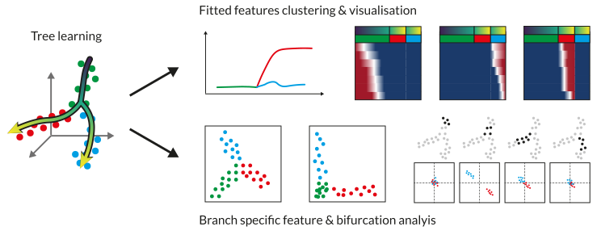

scFates - a suite for advanced pseudotime analysis
==================================================

**scFates** is a scalable Python suite for tree inference and advanced pseudotime analysis.

It initially is a translation from crestree_, a R package developed for the analysis of neural crest fates during
murine embryonic development (`Soldatov et al., Science, 2019 <https://doi.org/10.1126/science.aas9536>`_), and used
in another study of neural crest derived sensory neurons (`Faure et al., Nature Communications, 2020 <https://doi.org/10.1038/s41467-020-17929-4>`_).

The initial R version included a tree inference approach inspired from SimplePPT, this version now adds the choice of using ElPiGraph_,
another method for principal graph learning (`Albergante et al., Entropy, 2020 <https://doi.org/10.3390/e22030296>`_).
scFates is fully compatible with scanpy_, and contains GPU-accelerated functions for faster and scalable inference.

Analysis key steps
^^^^^^^^^^^^^^^^^^
- learn a principal tree on the space of your choice (gene expression, PCA, diffusion, ...).
- obtain a pseudotime value upon selection of a root (or two roots).
- test and fit features significantly changing along the tree, cluster them.
- perform differential expression between branches.
- identify branch-specific early activating features and probe their correlations prior to bifurcation.

.. toctree::
   :maxdepth: 2
   :hidden:

   installation
   notebooks/Basic_pseudotime_analysis
   notebooks/Advanced_bifurcation_analysis
   api
   references

|Doc Badge| |CircleCI Badge| |TravisCI Badge| |codecov Badge|

.. |Doc Badge| image:: https://readthedocs.org/projects/scfates/badge/?version=latest
.. |CircleCI Badge| image:: https://circleci.com/gh/LouisFaure/scFates.svg?style=shield
.. |TravisCI Badge| image:: https://api.travis-ci.com/LouisFaure/scFates.svg?branch=master
.. |codecov Badge| image:: https://codecov.io/gh/LouisFaure/scFates/branch/master/graph/badge.svg

.. _scanpy: https://scanpy.readthedocs.io/
.. _crestree: https://github.com/hms-dbmi/crestree
.. _ElPiGraph: https://github.com/j-bac/elpigraph-python/
